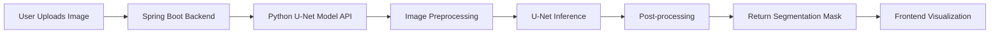

 # 🛰️ A User-Friendly Web Interface for Feature Extraction from Remote Sensing Satellite Images

---

## 🌍 Overview

This project enables pixel-wise land feature extraction from satellite imagery using an end-to-end deep learning pipeline. It empowers researchers, developers, and environmental planners with a **simple yet powerful web interface** to upload, analyze, and visualize segmented geographical data.

---

## 🔬 Key Features

- 🔍 **Semantic Segmentation with U-Net**  
  Pixel-level classification into land features: `Water`, `Vegetation`, `Road`, `Building`, `Land`, and `Background`.

- 🌐 **Web-Based Interface**  
  Upload satellite images directly via the frontend and receive color-coded segmentation masks in real time.

- 🧠 **Deep Learning Backend**  
  Python-based U-Net model trained on high-resolution Dubai Palm Beach images.

- ⚙️ **Microservice Architecture**  
  - Java Spring Boot – Handles API, user authentication, image upload
  - Python Flask/FastAPI – Runs the U-Net inference engine
  - JavaScript – Frontend interface and visualization

- 🌎 **Multi-region Testing**  
  - ✅ Trained on Dubai Palm Beach
  - 🧪 Tested on Jewar (India) and Hindon River regions for generalization

---

## 🧑‍💻 Tech Stack

| Layer          | Technology                              |
|----------------|------------------------------------------|
| Frontend       |    |
| Backend        |   |
| Deep Learning  |   |
| Deployment     | Localhost / Docker Ready                |

---

## 🗃️ Dataset

| Dataset        | Description                                                                  |
|----------------|-------------------------------------------------------------------------------|
| **Training**   | 70 High-res images from Dubai Palm Beach (with labeled masks of 6 classes)    |
| **Testing**    | 25 Images from Jewar region & 5 Images from Hindon River (Unseen during training) |

> ✅ Classes: `Water`, `Vegetation`, `Road`, `Building`, `Land`, `Unlabeled`

---

## 🖼️ Sample Segmentation Output

| Input Satellite Image | Segmented Output |
|------------------------|------------------|
|  |  |

*Color Encodings:*  
🔵 Water | 🟢 Vegetation | ⚫ Road | 🟥 Building | 🟤 Land | ⬛ Background

---

## 🔧 System Pipeline




## ⚙️ Setup & Run

### 🔧 Prerequisites

- Python 3.8+
- Java 11+
- Node.js (Frontend, optional for expansion)
- Maven for Spring Boot
- TensorFlow, OpenCV, Flask/FastAPI

### 🛠️ Installation & Execution

1. **Clone the Repository**
   ```bash
   git clone https://github.com/yourusername/feature-extraction-remote-sensing.git
   cd feature-extraction-remote-sensing

2. **Train or Load U-Net Model**
   ```bash
   python train_unet.py

3. **Start Python Inference Server**
   ```bash
   uvicorn app:app --reload

4. **Run Spring Boot Backend**
   ```bash
   cd spring-backend
   mvn spring-boot:run


## 👥 Contributors

| Name               | GitHub Username        |
|--------------------|-----------------------|
| Abhinay Goswami    | [Abhinay8506](https://github.com/Abhinay8506) |
| Divakar Sharma     | [Divakar-07](https://github.com/Divakar-07)  |
| Jay Kishor Thakur  | [jay-thakur-147](https://github.com/jay-thakur-147)  |
